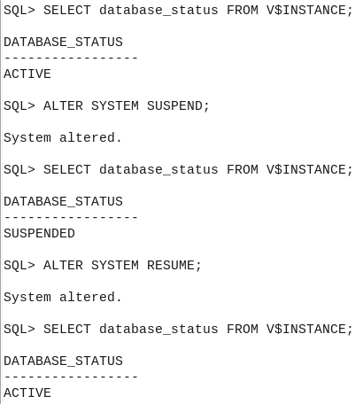
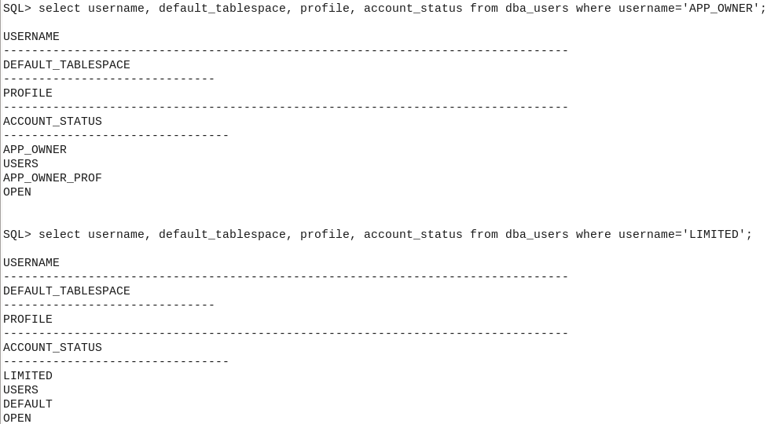

3. Шаблон БД и скрипты создания

[Шаблон БД](...)

[Скрипты создания](scripts.zip)

4. Вывод из словаря данных V$:


5. Создаем SPFILE 

[SPFILE](spfileoracleadm.ora)

6. Изменяем параметр системы:
```SQL
SQL> ALTER SYSTEM SET open_cursors=400 SCOPE=MEMORY;
```


7. Варианты монтирования и остановки БД:
```SQL
/* Переводим в READ ONLY*/
SQL> SHUTDOWN NORMAL;
SQL> STARTUP MOUNT;
SQL> ALTER DATABASE OPEN READ ONLY;
```

```SQL
/* Перевод в RESTRICT и обратно */
SQL> ALTER SYSTEM ENABLE RESTRICTED SESSION;
SQL> ALTER SYSTEM DISABLE RESTRICTED SESSION;
```


```SQL
/* В этом блоке подразумевается, что к базе подключено 2 пользователя, от одного выполняются команды SHUTDOWN, а действия второго помечены в комментарии */
SQL> SHUTDOWN NORMAL; /* Второй пользователь отсоединяется и только после этого база выключается */
SQL> SHUTDOWN TRANSACTIONAL; /* После выполнения команды COMMIT вторым пользователем экземпляр отключается */
SQL> SHUTDOWN IMMEDIATE; /* Второй пользователь получается сообщение ORA-12152: TNS: Unable to send break message. */

SQL> SHUTDOWN ABORT;
SQL> STARTUP MOUNT;
SQL> RECOVER DATABASE;
Media recovery complete.
```

8. В SUSPEND и обратно



9. Изменение параметров
```SQL
SQL> alter system set optimizer_mode = rule scope=spfile;
select value from v$parameter where name='optimizer_mode'
union all
select value from v$spparameter where name='optimizer_mode';
```


Поскольку значение измененного параметра не было сохранено в spfile, они действительны только для текущего экземпляра.

10. и 11. Создать профили, создать пользователей и применить к ним профили:
```SQL
/* a.	владелец приложения: без квоты на создание объектов, без ограничений по времени сессии,  количеству сессий, роли для просмотра словаря данных и динамических представлений */
SQL> CREATE PROFILE app_owner_prof LIMIT SESSIONS_PER_USER UNLIMITED CONNECT_TIME UNLIMITED;
SQL> CREATE USER APP_OWNER IDENTIFIED BY 12345678;
SQL> ALTER USER APP_OWNER PROFILE app_owner_prof;
SQL> GRANT UNLIMITED TABLESPACE TO APP_OWNER;
SQL> GRANT SELECT_CATALOG_ROLE TO APP_OWNER;
```

```SQL
/* b.	ограниченный: квота 50М, 15 мин простоя сессии, макс 2 сессии, без доступа к словарю данных */
SQL> CREATE PROFILE limited_prof LIMIT SESSIONS_PER_USER 2 IDLE_TIME 900;
SQL> CREATE USER LIMITED IDENTIFIED BY 12345678;
SQL> ALTER USER LIMITED PROFILE limited_prof;
SQL> ALTER USER LIMITED QUOTA 50M ON USERS;
```

12. продемонстрировать пользователя в dba_users, выборка параметров профиля для пользователя



13. Установить профиль b) как значение По-умолчанию для всех вновь создаваемых пользователей
```SQL
/* Я не нашел, можно ли использовать уже созданный профиль как профиль по-умолчанию, поэтому просто установил те же параметры */
SQL> ALTER PROFILE DEFAULT LIMIT SESSIONS_PER_USER 2 IDLE_TIME 900;
```


14. Создать  нового пользователя, убедиться, что профиль для него подключен, назначенный в п.13.

```SQL
SQL> CREATE USER TEST_USER IDENTIFIED BY 12345678;
SQL> SELECT profile FROM dba_users WHERE username='TEST_USER';

PROFILE
--------------------------------------------------------------------------------
DEFAULT
```

